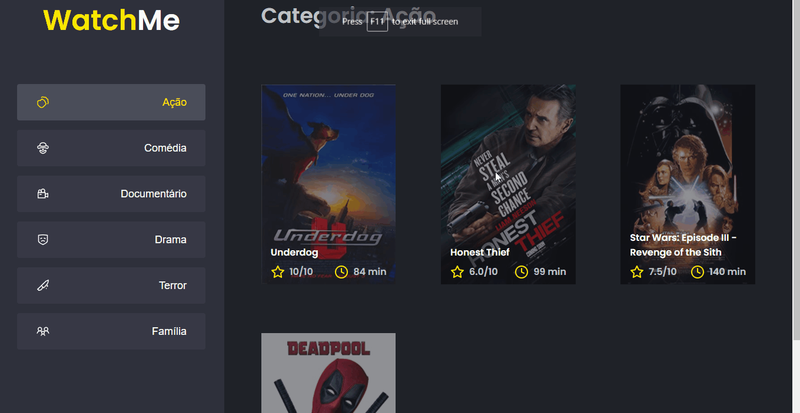

<section align="center">
    
</section>

---

<h2 align="center">Summary</h2>

    <a href="#description">📙 Description</a>
    <a href="#preview">🖼️ Preview</a>
    <a href="#technologies">💻 Technologies</a>

<H2 id="about">📙 Description</H2>

<h3>Challenge #2</h3>

Challenge about componentization of a fake api based application using React and Typescript. The learns includes basic json server functionality and componentization on the application

Originally created on Ignite from <a href="https://www.rocketseat.com.br/">Rocketseat</a> and made by <a href="https://www.linkedin.com/in/kleverson-kenji-iwatani/">Kenji Iwatani</a>

    <h4><a href="https://www.notion.so/Desafio-02-Componentizando-a-aplica-o-b9f0f025c95b437699d0c3115f55b0f1">Challenge description &rarr;</a></h3>

<h3>Challenge #8</h3>

Extra implementations focused on developing better performance of the challenge #2 app and practicing the usage of memo, useMemo, useCallback and others.

Originally created on Ignite from <a href="https://www.rocketseat.com.br/">Rocketseat</a> and made by <a href="https://www.linkedin.com/in/kleverson-kenji-iwatani/">Kenji Iwatani</a>

    <h4><a href="https://efficient-sloth-d85.notion.site/Desafio-01-Otimizando-a-aplica-o-2942004b422d455891756300d88d0b9a">Challenge description &rarr;</a></h3>

---

<H2 id="preview">🖼️ Preview</H2>

<section align="center">
    
</section>

---

<H2 id="technologies">💻 Technologies</H2>

- [x] <a href="https://reactjs.org/">React</a>
- [x] <a href="https://www.typescriptlang.org/">Typescript</a>
